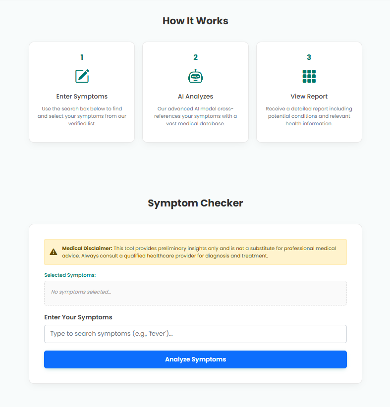
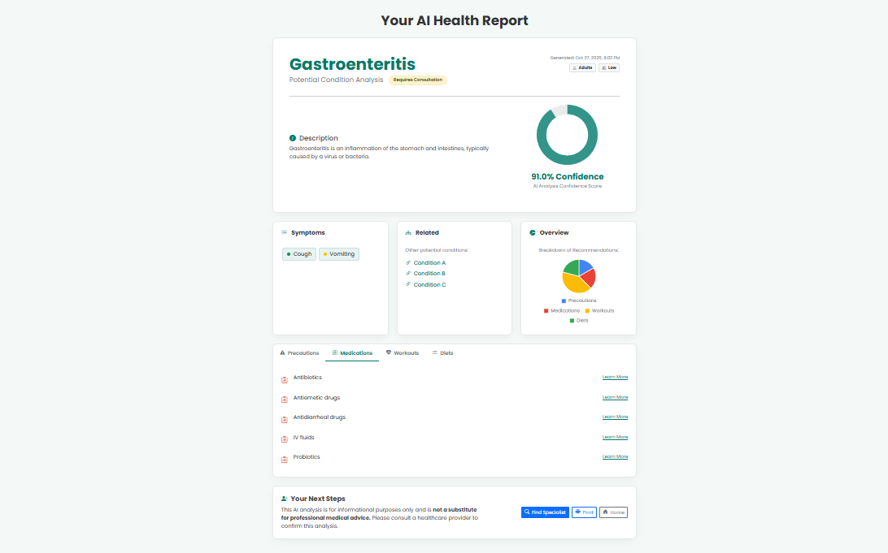

# 💊 PharmaPal - AI Symptom Checker


**PharmaPal** is an intelligent web application built with **Flask** that leverages a **Support Vector Machine (SVM)** model to predict potential medical conditions based on user-inputted symptoms. It provides a detailed, interactive health report including disease descriptions, precautions, potential medications, diets, and workouts.

---

## Demo

A quick look at the application in action:


*(Replace the link above with a GIF of your application. You can use tools like Giphy Capture or LICEcap to record one.)*

Or, add static screenshots:

| Home Page | Results Page |
| :---: | :---: |
|  |  |

---

## ✨ Key Features

- **🤖 AI-Powered Prediction**: Uses a pre-trained SVM model to analyze symptoms and predict a potential condition.
- **🔍 Interactive Symptom Selector**: A user-friendly, searchable dropdown to easily find and select multiple symptoms.
- **📊 Comprehensive Health Report**: Generates a dynamic report page with:
    - The predicted condition and its detailed description.
    - A (simulated) confidence score percentage.
    - A "Recommendations Overview" pie chart.
    - Tabbed sections for **Precautions**, **Medications**, **Diets**, and **Workouts**.
- **🧭 Clean & Responsive UI**: Built with HTML, CSS, and Bootstrap for a seamless experience on desktop and mobile.
- **🐍 Flask Backend**: A lightweight and robust backend to handle requests, process data, and serve predictions.

---

## 🧠 Tech Stack

| Category | Technology |
| :--- | :--- |
| **Backend** | Flask (Python) |
| **Machine Learning** | scikit-learn (Support Vector Classifier) |
| **Data Handling** | Pandas, NumPy |
| **Frontend** | HTML5, CSS3, JavaScript, Bootstrap 5 |
| **Visualization** | Chart.js |
---

## ⚙️ Local Setup & Installation

Follow these steps to run the project on your local machine:

### 1. Clone the Repository
```bash
git clone [https://github.com/your-username/PharmaPal.git](https://github.com/your-username/PharmaPal.git)
cd PharmaPal
```
```
2. Create and Activate a Virtual Environment

This isolates the project's dependencies from your system.

On Windows:
Bash

python -m venv venv
.\venv\Scripts\activate

On macOS/Linux:
Bash

python3 -m venv venv
source venv/bin/activate

```
```
3. Install Dependencies

Install all the required Python packages from requirements.txt.
Bash

pip install -r requirements.txt

(If you don't have a requirements.txt, create one with pip freeze > requirements.txt after installing Flask, Pandas, NumPy, and scikit-learn).

4. Run the Application

Start the Flask development server.
Bash

python app.py

```
```

5. Open in Browser

Once the server is running, open your web browser and go to: http://127.0.0.1:5000

```
```
⚠️ Medical Disclaimer

This application is for demonstration and informational purposes only.

The predictions and suggestions provided by PharmaPal are generated by a machine learning model and are not a substitute for professional medical advice, diagnosis, or treatment. Always consult a qualified healthcare provider with any questions you may have regarding a medical condition.

```
```
📂 Project Structure

PharmaPal/
├── app.py                # Main Flask application
├── models/
│   └── svc.pkl           # Pre-trained ML model
├── datasets/
│   ├── description.csv
│   ├── diets.csv
│   ├── medications.csv
│   ├── precautions_df.csv
│   ├── symptoms_df.csv
│   └── workout_df.csv
├── templates/
│   ├── index.html        # Home page
│   ├── results.html      # Results page
│   ├── symptoms.html     # Symptom reference list
│   └── ... (other pages)
├── static/
│   ├── style.css         # Custom stylesheets
│   └── img.png           # Logo/favicon
├── requirements.txt      # Python dependencies
├── .gitignore            # Files for Git to ignore
└── README.md             # You are here!

```
👨‍💻 Author

Suyash Joshi

    Email: suyash.joshisj01@gmail.com

    LinkedIn: Your LinkedIn Profile URL

    GitHub: Your GitHub Profile URL

⭐ Acknowledgements

    Medical dataset adapted from open-source repositories.

    Built with the help of the Flask and scikit-learn documentation.
